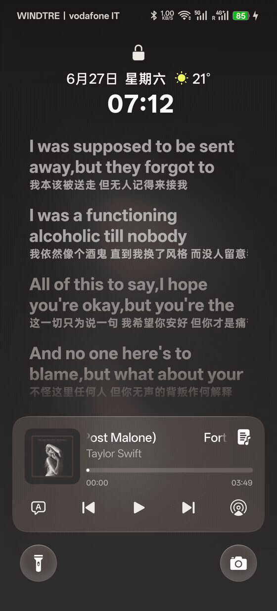

# ColorOS Live Lyrics Bridge

  

## 简体中文

把更多音乐 App 的歌词送进 ColorOS / OPlus 自带的锁屏歌词页面。

它不是悬浮窗：歌词仍由系统原生界面显示，模块负责补充完整时间轴、逐字高亮、翻译和外观设置。

### v3.7.1 更新了什么

- 修复 ColorOS 16.0.10.x（如 OPPO X9s Pro）上 SystemUI 歌词 Hook 失效：该版本系统界面版本号仍为 16.99.12，但媒体 RUS 管理器已重构（`getRusWhiteList` 删除、`saveListToSP` 变静态 10 参数、`updatePkgActionsRule` 增至 6 个 Map、白名单改经 `MediaRusConfig` 暴露）。Bridge 的 DexKit 解析升级为双锚点集并兼容新旧方法签名，解析日志新增 `rusVariant`；16.0.9.x 及更早构建行为保持不变。
- 修复 v3.7.0 回归：普通逐行歌词（无逐字时间戳）的实时行不再以 100% 不透明度高亮。恢复激活行整行高亮，并在"普通逐行歌词进度"开关开启时同样生效；带逐字歌词与 AOD 低帧率填充行为不变。
- 两项修复均通过单元测试（42 套件 / 412 项）与 Debug 构建；16.0.9.x 与 16.0.10.x 真机验证通过，高亮修复经开发者与反馈用户实测确认。
- 升级时请从同一 Release 安装 `ColorOS-Live-Lyrics-Bridge-v3.7.1.apk` 与对应播放器的 Provider APK；ColorOS 16.0.10.x 用户本次为必须升级。

### 主要功能

- 原生锁屏与 AOD 歌词，不额外覆盖悬浮窗口。
- 普通逐行、逐字高亮与翻译歌词。
- 长句自动换行或平滑浏览，兼顾中文、日文等无空格文本。
- 四种外观预设和实时预览。
- 可调颜色、透明度、光晕、模糊、缩放、动效、字号、字重和对齐；歌词之间与同一句内部换行的间距可以分开设置。
- 可按播放器记住翻译开关，清理歌词开头的歌名、制作信息和版权行。
- 歌词显示时可保持屏幕点亮，也可自定义亮屏时长。
- 保留系统媒体卡片原本的上一首、播放/暂停和下一首操作。

### 使用条件

- 已 Root，并安装支持 **libxposed API 102** 的 LSPosed / LSP 管理器。
- 系统本身带有 ColorOS / OPlus 原生锁屏歌词页面。
- 当前主要围绕 ColorOS 16 的歌词链路开发和验证。不同 OPPO、一加、真我机型及不同 SystemUI 版本可能需要单独适配。
- 如果系统原本没有锁屏歌词页面，本模块不会新建一个悬浮歌词窗口。

### 播放器支持

| 播放器 | 还要安装什么 | 歌词能力 |
| --- | --- | --- |
| Salt Player | 无 | Bridge 内置适配；逐字与翻译取决于播放器数据 |
| ConePlayer / 光锥音乐 | 无 | Bridge 内置适配；正式版与 Google Play 版 |
| [Metrolist](https://github.com/metrolistgroup/metrolist) | `LyricProvider-Metrolist` | 按播放器设置的供应商顺序搜索；BetterLyrics / KuGou 支持逐字歌词，LrcLib 可回退逐行歌词；不支持翻译歌词，也不支持词幕（Lyricon） |
| QQ 音乐 | `LyricProvider-QQMusic` | 逐字、翻译 |
| 网易云音乐 / 荣耀版 | `LyricProvider-163Music` | 逐字、翻译 |
| Apple Music | `LyricProvider-AppleMusic` | 逐字、翻译；不输出背景人声和对唱分轨 |
| LX Music（ToSide / Walnut 版本） | `LyricProvider-LXMusic` | 完整时间轴歌词；播放器提供时支持翻译歌词 |
| Poweramp | `LyricProvider-Poweramp` | 本地内嵌歌词与可匹配的在线歌词 |
| Spotify | `LyricProvider-Spotify` | 目前仅原文标准歌词，不支持翻译 |
| 汽水音乐 | `LyricProvider-QiShui` | 逐字、翻译；需做好 Root 隐藏并完成下方设置 |
| 酷狗音乐 / 概念版 | `LyricProvider-KuGou` | 逐字、翻译 |

[Metrolist](https://github.com/metrolistgroup/metrolist) 是**适用于安卓系统的 YouTube Music 客户端**。由于 Metrolist 本身没有稳定的歌词获取接口，本 Provider 采用与 Metrolist 相同的方式从第三方歌词提供商获取歌词，因此两者获取的歌词可能存在差异。

### 安装方法

1. 安装 Release 中的 `ColorOS-Live-Lyrics-Bridge-<版本>.apk`。
2. 在 LSPosed 中启用 Bridge，并保留推荐作用域。
3. 表格中标注 Provider 的播放器，还要安装同一 Release 中对应的 `LyricProvider-*.apk`。
4. 在 LSPosed 中单独启用 Provider，只勾选它对应的音乐 App。
5. 重启手机。

`LyricProvider-<版本>.zip` 只是全部 Provider APK 的下载合集，不是 Recovery 刷机包。只安装自己需要的 Provider 即可。

**汽水音乐用户：**还需在 LSP 管理器中为汽水音乐开启“还原内联钩子”，并按管理器提示处理 `libart.so`；同时需做好 Root 隐藏。

### 遇到问题先检查

- Bridge 和 Provider 是否来自同一个 Release。
- 是否保留 Bridge 推荐作用域，并给 Provider 选中了正确的音乐 App。
- 系统是否真的带有 OPlus 原生锁屏歌词页面。
- 只有普通歌词、没有逐字或翻译时，通常是当前歌词源没有提供相应数据。
- 系统或播放器大版本更新后失效，请在 Issues 中附上机型、系统、SystemUI、播放器版本和 LSPosed 日志。

[下载完整 Release](https://github.com/Andrea-lyz/ColorOS-Live-Lyrics-Bridge/releases/latest) · [源码与详细说明](https://github.com/Andrea-lyz/ColorOS-Live-Lyrics-Bridge) · [问题反馈](https://github.com/Andrea-lyz/ColorOS-Live-Lyrics-Bridge/issues)

---

## English

Bring lyrics from more music apps to the native ColorOS / OPlus lock-screen lyric page.

This is not a floating overlay. The system still owns the lyric UI; the module adds full timelines, word-by-word highlighting, translations, and appearance controls.

### What's new in v3.7.1

- Fixes SystemUI lyric-hook failure on ColorOS 16.0.10.x (e.g. OPPO X9s Pro): the SystemUI still reports version 16.99.12, but its media RUS manager was refactored (`getRusWhiteList` removed, `saveListToSP` now a static 10-parameter method, `updatePkgActionsRule` grew to 6 maps, and the whitelist moved into `MediaRusConfig`). DexKit resolution now uses dual anchor sets and accepts both old and new method shapes, and the resolution log gained a `rusVariant` marker; 16.0.9.x and older builds are unchanged.
- Fixes a v3.7.0 regression where the active line of plain line-timed lyrics (no word timing) lost its full-opacity highlight. The active line is highlighted again in both line-timed progress modes; word-timed reveal and AOD low-frame-rate fill are unchanged.
- Both fixes pass unit tests (42 suites / 412 tests) and Debug builds, with device verification on 16.0.9.x and 16.0.10.x; the highlight fix was confirmed by the developer and the reporting user.
- Install `ColorOS-Live-Lyrics-Bridge-v3.7.1.apk` and the matching Provider APK from the same release when upgrading. ColorOS 16.0.10.x users must upgrade.

### Highlights

- Native lock-screen and AOD lyrics, without a separate overlay.
- Line-timed lyrics, word-by-word highlighting, and translations.
- Better wrapping and smooth browsing for long CJK and other no-space text.
- Four appearance presets with a live preview.
- Controls for color, opacity, glow, blur, scale, motion, text size, weight, and alignment, with separate spacing for lyric rows and wrapped lines.
- Per-player translation preferences and guided removal of leading title, credit, and copyright lines.
- Optional keep-screen-awake behavior with a custom duration.
- Preserves the stock media card's previous, play/pause, and next actions.

### Requirements

- Root and an LSPosed / LSP manager that supports **libxposed API 102**.
- A ColorOS / OPlus ROM that already provides the native lock-screen lyric page.
- Current development and testing mainly target the ColorOS 16 lyric path. Compatibility may vary between OPPO, OnePlus, and realme devices or SystemUI releases.
- The module does not create a floating lyric window on ROMs that have no native lyric page.

### Supported players

| Player | Additional module | Lyric support |
| --- | --- | --- |
| Salt Player | None | Built into the Bridge; word timing and translations depend on player data |
| ConePlayer | None | Built into the Bridge; standard and Google Play packages |
| [Metrolist](https://github.com/metrolistgroup/metrolist) | `LyricProvider-Metrolist` | Follows the configured provider order; BetterLyrics and KuGou support word timing, with LrcLib as a line-timed fallback; translations and Lyricon integration are not supported |
| QQ Music | `LyricProvider-QQMusic` | Word-timed lyrics and translations |
| NetEase Cloud Music / Honor edition | `LyricProvider-163Music` | Word-timed lyrics and translations |
| Apple Music | `LyricProvider-AppleMusic` | Word-timed lyrics and translations; background-vocal and duet lanes are excluded |
| LX Music (ToSide / Walnut variants) | `LyricProvider-LXMusic` | Full lyric timeline and translations when supplied by the player |
| Poweramp | `LyricProvider-Poweramp` | Embedded local lyrics and lyrics available through provider matching |
| Spotify | `LyricProvider-Spotify` | Standard original lyrics only; no translation support yet |
| QiShui Music | `LyricProvider-QiShui` | Word-timed and translated lyrics; proper root hiding and the extra step below are required |
| KuGou Music / Concept | `LyricProvider-KuGou` | Word-timed lyrics and translations |

[Metrolist](https://github.com/metrolistgroup/metrolist) is a **YouTube Music client for Android**. Because Metrolist itself does not provide a stable lyric retrieval interface, this Provider retrieves lyrics from third-party lyric providers in the same way as Metrolist. The lyrics selected by the Provider may therefore differ from those shown inside Metrolist.

### Installation

1. Install `ColorOS-Live-Lyrics-Bridge-<version>.apk` from the release.
2. Enable the Bridge in LSPosed and keep its recommended scope.
3. For players marked with a Provider above, install the matching `LyricProvider-*.apk` from the same release.
4. Enable each Provider separately in LSPosed and select only its matching music app.
5. Reboot the device.

`LyricProvider-<version>.zip` is only a bundle of all Provider APKs; it is not a Recovery-flashable package. Install only the Providers you need.

**QiShui users:** also enable **Restore inline hooks** for QiShui in the LSP manager and follow its instructions for handling `libart.so`; ensure root hiding is properly configured as well.

### Quick checks when something does not work

- Confirm that the Bridge and Providers came from the same release.
- Keep the Bridge's recommended scope and select the correct music app for each Provider.
- Confirm that the ROM actually has the native OPlus lock-screen lyric page.
- If line lyrics work but word timing or translations do not, the lyric source probably does not supply that data.
- After a major OS or player update, include the device, OS, SystemUI, player versions, and LSPosed logs in an issue.

[Download the complete release](https://github.com/Andrea-lyz/ColorOS-Live-Lyrics-Bridge/releases/latest) · [Source and full documentation](https://github.com/Andrea-lyz/ColorOS-Live-Lyrics-Bridge) · [Report an issue](https://github.com/Andrea-lyz/ColorOS-Live-Lyrics-Bridge/issues)

### Support

  

